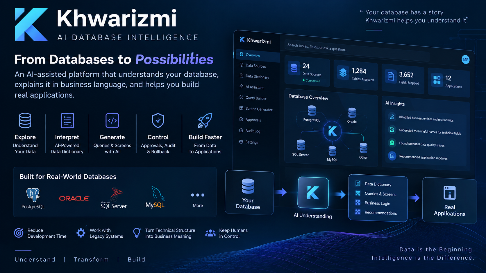

<p align="center">
  
</p>

# Khwarizmi | خَوَارِزْمِيّ
## AI Database Intelligence & Governed Automation

> **Understand the database. Discover the business. Build faster.**

Khwarizmi is an **AI-assisted database intelligence platform** designed for complex, undocumented and legacy enterprise databases. It discovers database structure, builds a semantic understanding layer, and helps transform technical schemas into understandable business concepts, queries, screens and controlled operations.

The platform is designed around a simple idea:

**Database → Metadata → Semantic Understanding → Data Dictionary → Queries & Screens → Governed Actions**

---

## The Problem

Large enterprise databases often evolve for years. They may contain:

- Hundreds or thousands of tables
- Cryptic table and column names
- Abbreviations and legacy naming conventions
- Missing or outdated documentation
- Relationships understood only by experienced developers
- Multiple database technologies
- High risk when performing direct data operations

Before a developer can build a new application, report or integration, a significant amount of time can be spent simply understanding what the database means.

Khwarizmi turns that discovery process into an intelligent, reusable workflow.

---

# Core Capabilities

## 1. Multi-Database Discovery

Khwarizmi provides a foundation for connecting to heterogeneous enterprise databases and inspecting their metadata.

Supported database families include:

- PostgreSQL
- Oracle
- Microsoft SQL Server
- MySQL

The metadata scanner can build an inventory of database structures that becomes the foundation for further analysis.

---

## 2. Database Metadata Intelligence

The platform analyzes technical metadata such as:

- Tables
- Columns
- Data types
- Keys
- Relationships
- Structural patterns
- Naming conventions

Instead of treating the schema as a flat technical catalog, Khwarizmi prepares it for semantic interpretation.

---

## 3. Semantic Data Dictionary

Khwarizmi creates a semantic layer between the physical database and the people who need to understand it.

The dictionary can associate technical structures with:

- Human-readable names
- Business descriptions
- Suggested meanings
- Entity context
- Relationships
- Review status

This knowledge can then be reused by developers, analysts and AI-assisted workflows.

---

## 4. AI-Assisted Interpretation

AI can assist with interpreting abbreviated, unclear or legacy database names and proposing understandable descriptions.

The architecture supports **local AI** environments such as:

- LM Studio
- Ollama
- Local language models

A rule-based fallback can support parts of the interpretation workflow when an AI model is unavailable.

AI suggestions remain reviewable rather than silently becoming authoritative database knowledge.

---

## 5. Human-in-the-Loop Knowledge Validation

Khwarizmi is designed around **AI assistance + human control**.

A semantic suggestion can be reviewed before it becomes trusted knowledge. This makes the data dictionary progressively more valuable while avoiding blind dependence on generated interpretations.

**Discover → Suggest → Review → Confirm → Reuse**

---

## 6. Query Builder

Once database structures are understood, the platform can assist in building database queries using the discovered schema and semantic dictionary.

The query layer is designed with database-dialect awareness so that different database engines can be handled through a common workflow.

This creates a bridge between:

**Business Intent ↔ Semantic Model ↔ Database Query**

---

## 7. Screen Generation Foundation

Khwarizmi explores the next step after understanding a database: helping transform known structures into usable application interfaces.

The platform includes a foundation for assisted screen generation based on database metadata and semantic understanding.

The concept is:

**Understand the data first — then accelerate application construction.**

---

## 8. Governed Data Operations

Enterprise automation must not mean uncontrolled database execution.

Khwarizmi therefore separates understanding and generation from execution through governed operational controls.

The operations foundation includes:

- Preview before execution
- Controlled execution
- Approval workflow
- Audit trail
- Shadow / backup data
- Rollback support

This enables automation while keeping critical actions observable and recoverable.

---

## 9. Approval Workflow

Sensitive operations can move through an approval process before execution.

This allows organizations to introduce AI-assisted automation without removing human authority from important database actions.

**Generate → Preview → Review → Approve → Execute → Audit**

---

## 10. Auditability

Khwarizmi includes audit-oriented architecture covering important platform actions.

The objective is not simply to know that something changed, but to preserve operational accountability around controlled database activity.

---

## 11. Rollback-Oriented Safety

Before controlled changes are executed, the architecture can preserve relevant previous data in shadow records so that operations have a recovery path.

This is especially important when automation interacts with existing enterprise systems.

---

# From Legacy Database to Business Understanding

```text
        Enterprise Database
               │
               ▼
        Metadata Scanner
               │
               ▼
      Structural Discovery
               │
               ▼
      AI / Rule Interpretation
               │
               ▼
       Semantic Dictionary
          ┌────┴─────┐
          ▼          ▼
       Queries     Screens
          │          │
          └────┬─────┘
               ▼
        Preview & Review
               │
               ▼
          Approval
               │
               ▼
      Controlled Execution
               │
        ┌──────┴──────┐
        ▼             ▼
      Audit        Rollback
```

---

# Why Khwarizmi?

Khwarizmi is designed to reduce one of the hidden costs of enterprise software development:

> **The time required to understand existing systems before useful development can even begin.**

Potential use cases include:

- Legacy-system discovery
- Database documentation
- Application modernization
- Rapid internal-tool development
- Reporting and analytics preparation
- Developer onboarding
- Data integration discovery
- AI-agent database grounding
- Controlled database operations

---

# Privacy & On-Premise AI

For organizations where database structures and business information cannot be sent to external AI services, Khwarizmi is designed with **local AI / on-premise deployment** in mind.

This allows semantic assistance to operate closer to enterprise data while supporting organizational privacy requirements.

---

# Technology

**Backend / Platform**
- Java
- SQL
- Database metadata APIs
- Modular service architecture

**Databases**
- PostgreSQL
- Oracle
- Microsoft SQL Server
- MySQL

**AI**
- Local LLM integration
- LM Studio
- Ollama
- Rule-based fallback
- AI-assisted semantic interpretation

**Governance**
- Authentication
- Roles
- Settings
- Approval workflows
- Audit logging
- Preview / execution separation
- Rollback-oriented operations

---

# Product Vision

Khwarizmi is not intended to be another SQL editor.

Its vision is to become an **intelligence layer between enterprise databases and the people, applications and AI agents that need to understand them.**

### Database Intelligence
Understand structures and relationships.

### Semantic Intelligence
Translate technical schemas into business meaning.

### Development Intelligence
Use that understanding to accelerate queries and application screens.

### Operational Intelligence
Execute controlled actions through governance, auditing and recovery mechanisms.

---

## Portfolio & Confidentiality Notice

This repository is a **sanitized public showcase**.

It intentionally excludes:

- Production source code
- Database credentials
- Internal IP addresses
- Customer database names
- Production schemas
- Proprietary prompts
- Real enterprise data
- Internal infrastructure configuration
- Security-sensitive implementation details

The private development repository remains separate from this public portfolio representation.

---

## Khwarizmi | خَوَارِزْمِيّ

**AI Database Intelligence • Legacy System Understanding • Local AI • Governed Automation**

### Understand the Data. Discover the Business. Build with Intelligence.
